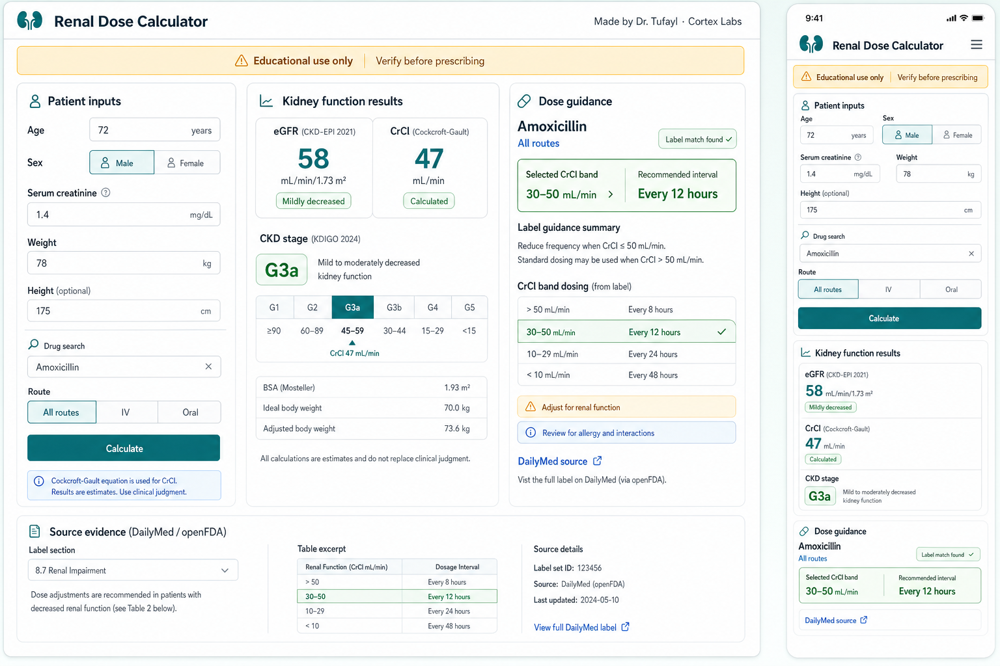

# Renal Dose Calculator

Adult kidney-function calculator and renal-dose guidance app built by
**Dr. Tufayl (Cortex Labs)**.

[Live app](https://renal-dose-calculator.pages.dev) ·
[Deployment notes](docs/DEPLOYMENT.md) ·
[Data strategy](docs/DATA_STRATEGY.md) ·
[Security](SECURITY.md)



## What It Does

Renal Dose Calculator is a browser-first clinical utility for quick adult renal
assessment:

- Calculates CKD-EPI 2021 creatinine eGFR.
- Calculates Cockcroft-Gault creatinine clearance for drug dosing decisions.
- Accepts quick free-text input such as `72 M 78 kg 1.4 meropenem`.
- Normalizes common drug names using local aliases and RxNorm/RxNav fallback.
- Looks up human drug labels from DailyMed/openFDA.
- Produces a concise renal-dose guidance card when label data can be parsed or
  summarized safely.
- Keeps a DailyMed source link visible so the original label can be reviewed.
- Installs as a lightweight PWA with an offline app shell for kidney-function
  calculations.
- Includes Telegram Mini App support and a WhatsApp text webhook.

## Clinical Scope

This project is intentionally narrow in the first production track:

- Adults only, age 18 years and above.
- Serum creatinine unit: mg/dL.
- Weight is required for Cockcroft-Gault CrCl.
- Height is optional and used for BMI, ideal body weight, and adjusted body
  weight estimates.
- Route options: IV or oral.
- Drug source target: human DailyMed/openFDA labels.

**Educational purpose only. Results are estimates and are not for prescribing.**
The app is not a replacement for clinician judgment, pharmacist review, local
protocols, allergy checks, interaction checks, indication-specific dosing, or
the official prescribing information.

## Current Product Status

The app is a beta clinical decision-support prototype.

The live renal-dose pathway uses:

1. Deterministic kidney-function calculations.
2. Drug-name normalization.
3. DailyMed/openFDA label lookup.
4. Special deterministic handlers for selected high-risk/common drugs.
5. Label-table parsing where possible.
6. AI-assisted source summarization only when Cloudflare Workers AI is
   configured and within the free-mode guard.
7. Source-review fallback when the app cannot produce a clean label-backed
   answer.

The older curated renal-dose database remains in the repository for future
review, but it is not the active primary dose pathway.

## Tech Stack

- Frontend: plain HTML, CSS, and modern JavaScript.
- App shell: installable PWA with Web App Manifest and Service Worker caching.
- Functions: Cloudflare Pages Functions.
- Hosting: Cloudflare Pages.
- AI experiment: Cloudflare Workers AI with strict source-grounded output.
- Drug labels: DailyMed/openFDA.
- Drug normalization fallback: RxNorm/RxNav.
- Tests: Node.js built-in test runner.
- CI: GitHub Actions.

## Repository Layout

```text
functions/api/renal-dose/assist.js   DailyMed/openFDA + dose guidance API
functions/api/telegram/webhook.js    Telegram Mini App launcher webhook
functions/api/whatsapp/webhook.js    WhatsApp Cloud API text webhook
src/                                Frontend and shared calculation modules
src/data/renalRules/                Parked curated renal-rule draft database
test/                               Unit and integration tests
docs/                               Clinical, deployment, and setup notes
wrangler.toml                       Cloudflare Pages/Functions config
```

## Local Development

Install dependencies:

```bash
npm install
```

Run the static frontend:

```bash
npm run dev
```

Open:

```text
http://localhost:5173
```

Run with Cloudflare Pages Functions locally:

```bash
npm run cf:dev
```

Use the Cloudflare runtime when testing the renal-dose API, Telegram webhook,
WhatsApp webhook, cache behavior, KV bindings, or Workers AI binding.

## Tests

```bash
npm test
```

The test suite covers renal calculations, quick input parsing, drug
normalization, DailyMed/openFDA route matching, label parsing, AI-output
validation, Telegram webhook behavior, and WhatsApp webhook behavior.

## Environment And Secrets

Use `.env.example` as a template only. Real secrets must be stored in
Cloudflare Pages, not committed to Git.

Required or optional production secrets:

- `TELEGRAM_BOT_TOKEN`
- `TELEGRAM_WEBHOOK_SECRET`
- `WHATSAPP_VERIFY_TOKEN`
- `WHATSAPP_PHONE_NUMBER_ID`
- `WHATSAPP_ACCESS_TOKEN`
- `WHATSAPP_APP_SECRET`

Configured public runtime variables live in `wrangler.toml`.

## Deployment

Current target:

- GitHub repository: `tufayl-ahmed/renal-dose-calculator`
- Production branch: `main`
- Cloudflare Pages project: `renal-dose-calculator`
- Build command: none
- Build output directory: `.`

Manual deploy during development:

```bash
npm run deploy
```

The intended production workflow is GitHub-to-Cloudflare auto-deploy through
GitHub Actions: push to `main`, tests run, and Wrangler deploys the existing
Cloudflare Pages project when deployment is enabled.

## Free-First Architecture

The project is designed to stay free-first while it is being validated:

- Cloudflare Pages free hosting during development.
- Free `*.pages.dev` domain until a custom domain is chosen.
- DailyMed, openFDA, and RxNorm/RxNav as open public data sources.
- Cloudflare Workers AI only behind an app-level free-mode guard.
- Caching to reduce repeated label and AI calls.

`FREE_AI_DAILY_REQUEST_LIMIT` is an app-level request guard. It is not the same
thing as Cloudflare's Workers AI neuron accounting.

## Roadmap

- Connect Cloudflare Pages to GitHub auto-deploy.
- Add a reviewed structured renal-dose database for common drugs.
- Expand clinical validation tables.
- Improve route, formulation, dialysis, and indication handling.
- Add stronger monitoring for API failures and source-review fallbacks.
- Decide on a custom domain and public release posture.

## Security

This repository should never contain real API tokens, webhook secrets, private
keys, `.env` files, or provider credentials. See [SECURITY.md](SECURITY.md).

Secret scans have been run locally with `gitleaks` before deployment setup.

## License

MIT License. See [LICENSE](LICENSE).

The MIT license covers the software code. The clinical disclaimer still applies:
this app is educational only, results are estimates, and outputs are not for
prescribing.
