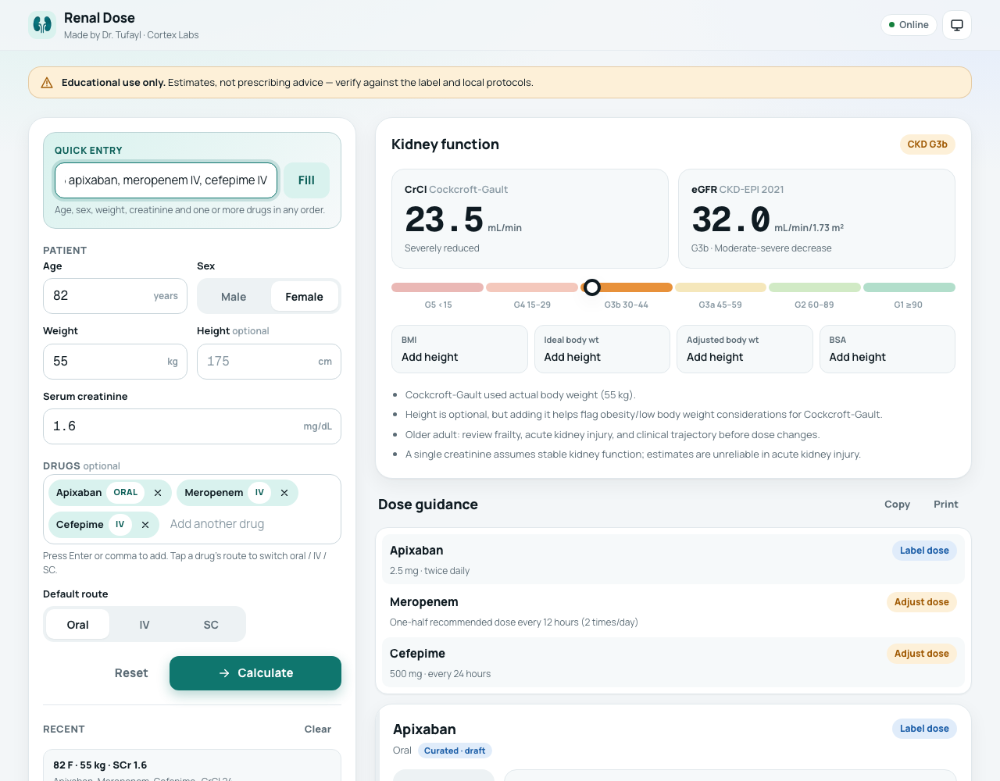
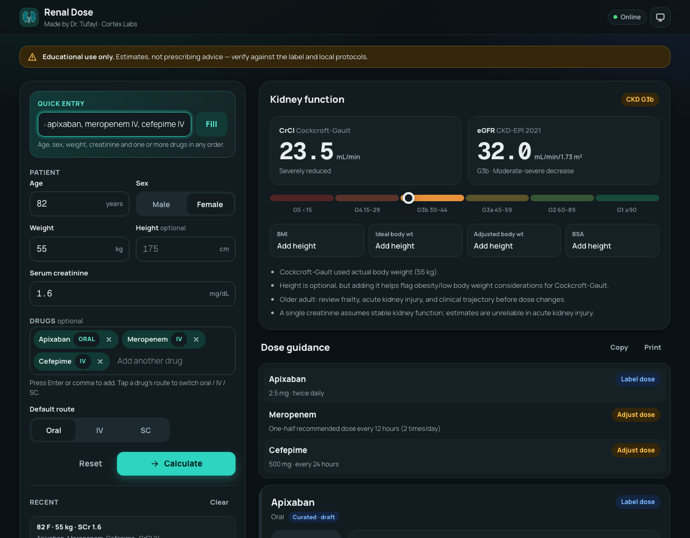

# Renal Dose Calculator

Adult kidney-function calculator and renal-dose guidance app built by
**Dr. Tufayl (Cortex Labs)**.

[Live app](https://renal-dose-calculator.pages.dev) ·
[Dose database & review](docs/RENAL_DOSE_CURATION.md) ·
[Deployment](docs/DEPLOYMENT.md) ·
[Security](SECURITY.md)



<details><summary>Dark theme</summary>



</details>

## What it does

- CKD-EPI 2021 creatinine eGFR with KDIGO G category, updated as you type.
- Cockcroft-Gault creatinine clearance for drug dosing, plus BMI, ideal and
  adjusted body weight and BSA when height is given.
- Checks **several drugs at once**, each with its own route (oral, IV,
  subcutaneous), and shows one card per drug with the renal band, dose,
  cautions, the full dose table and the DailyMed source.
- Quick entry in one line, e.g. `72 M 78 kg SCr 1.4 meropenem IV, doxy oral`
  (creatinine in mg/dL or µmol/L, e.g. `SCr 124`).
- Creatinine unit toggle (mg/dL ⇄ µmol/L) and choice of actual, ideal or
  adjusted body weight for Cockcroft-Gault.
- Dialysis status (hemodialysis, peritoneal, CRRT) and an "unstable
  creatinine / AKI" flag that change and annotate the guidance.
- Share link (the check is stored in the URL fragment, never sent to the
  server) and print / save as PDF.
- Clinician review page (`/review.html`) to verify or retire records.
- Every answer carries a source badge so you know how much to trust it:
  **Clinician-verified**, **Curated · draft**, **Auto-extracted**,
  **Label logic/table**, **AI summary** or **Review source**.
- Light and dark themes, print-friendly result sheet, copy summary, recent
  checks, installable PWA that works offline for kidney calculations.
- Telegram Mini App launcher.

## Clinical scope

Adults (≥18 years), serum creatinine in mg/dL or µmol/L, weight required for
Cockcroft-Gault (actual by default; ideal or adjusted weight selectable when
height is given). On intermittent dialysis the app uses the label's dialysis
rule where one exists, otherwise the lowest renal band, and asks for review;
on CRRT it always asks for review.

**Educational purpose only. Results are estimates and are not for prescribing.**
The app does not replace clinician judgment, pharmacist review, local
protocols, allergy or interaction checks, or the official prescribing
information.

## How dose guidance is found

```text
drug + route + CrCl/eGFR
  1. curated renal rule database (205 drugs; draft or clinician-verified)
  2. auto-extracted label candidates (unreviewed snapshots of step 3)
  3. live DailyMed/openFDA label: drug-specific logic, renal table parser
  4. Workers AI summary of the label text (validated against the source)
  5. "Review source" with the DailyMed link
```

Steps 1–2 need no network call. See
[docs/RENAL_DOSE_CURATION.md](docs/RENAL_DOSE_CURATION.md) for the review
workflow (spreadsheet export/import) and how to grow the database.

## Tech stack

- Frontend: HTML, CSS and JavaScript modules, built with Vite; service worker
  generated by vite-plugin-pwa.
- API: Cloudflare Pages Functions (`functions/`), logic in `server/renalDose/`.
- Data: DailyMed/openFDA labels, RxNorm/RxNav name normalisation.
- Optional AI: Cloudflare Workers AI behind a free-mode request guard.
- Tests: Node test runner (unit + recorded API replay) and Playwright (desktop
  and mobile). CI: GitHub Actions.

## Repository layout

```text
index.html, src/app.js          App shell and bootstrap
review.html, src/review.js      Clinician rule review page
src/ui/                         UI modules (form, drug chips, dose cards, theme…)
src/doseView.js                 View model for dose results
src/renal.js                    eGFR / CrCl / body-size equations
src/curatedDoseRules.js         Rule matching engine
src/data/renalRules/            Curated records, candidates, verifications
server/renalDose/               Dose pipeline, openFDA lookup, label logic, AI
functions/api/                  Cloudflare Pages Functions (dose API, Telegram)
scripts/                        Rule review, candidate extraction, QA scripts
test/, e2e/                     Unit and end-to-end tests
public/                         Static assets, manifest, _headers
```

## Development

```bash
npm install
npm run dev        # UI on http://localhost:5173
npm run cf:dev     # built app + API on http://localhost:8788 (no login needed)
npm run check      # lint, unit tests, build
npm run test:e2e   # Playwright (run `npx playwright install chromium` once)
```

Useful data scripts:

```bash
npm run rules:export                          # CSV for clinician review
npm run rules:import -- docs/curation/rule-review.csv
npm run candidates:extract -- --limit=200     # grow the database from labels
npm run fixtures:record                       # refresh API replay fixtures
```

## Deployment

Cloudflare Pages project `renal-dose-calculator`, build command
`npm run build`, output `dist`. GitHub Actions runs lint, tests, build and
Playwright, then deploys `dist/` when `CLOUDFLARE_DEPLOY_ENABLED=true`. See
[docs/DEPLOYMENT.md](docs/DEPLOYMENT.md).

Secrets (`TELEGRAM_BOT_TOKEN`, `TELEGRAM_WEBHOOK_SECRET`) live in Cloudflare
Pages, never in Git.

## License

MIT License. See [LICENSE](LICENSE). The clinical disclaimer still applies:
educational only, results are estimates, not for prescribing.
